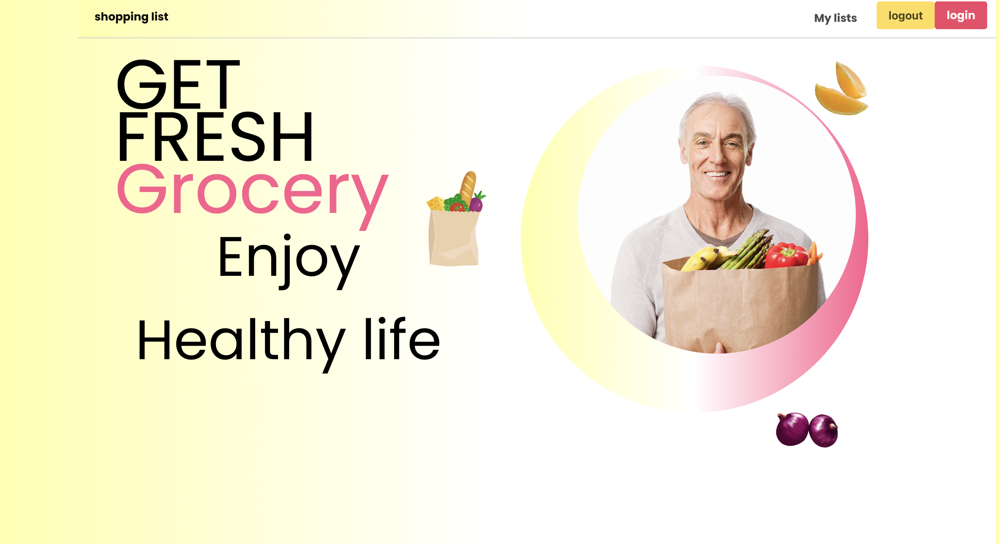

# Project 2 Shopping List 

## Description

As a Full Stack Developer we wanted to explore or collaborative skills and coding abilitie by creating a internative shopping list using Node.js and Express.js powered by MySql database and using a folder structure that meets the MVC paradigm.

## Table of Contents 

- [Installation](#installation)
- [Usage](#usage)
- [Credits](#credits)
- [License](#license)

## Installation

What are the steps required to install your project? Provide a step-by-step description of how to get the development environment running.

Steps for insallation:

1. Install MYSQL 
2. Run MYSQL 
3. Download repository 
4. Install "node.js" from https://nodejs.org/en/download/
5. While in terminal under the reposirtory directory run the "npm i" command.

## Usage

Provide instructions and examples for use. Include screenshots as needed.

- Each user would sign in and then create there own shopping list.

- Each user will have the option to sign up, if not yet created an account to log in.

- Application uses a Node.js and Express.js back end and uses both GET and POST routes for retrieving and adding new data.

* Application has a folder structure that meets the MVC paradigm and uses Handlebars.js as the template engine.

* Application is backed by a MySQL database with a Sequelize ORM and protects API keys and sensitive information with environment variables.

* Application includes user authentication (express-session and cookies).

* Application uses at least one new library, package, or technology not covered in class.

<a href="https://shopping-list-project2.herokuapp.com/">Click here for live link!</a>

    

## Credits

We would to credit and thank you contributors.

- Justin Fleming 
- Anisa Ali
- Alec Simone
- Taja Jones

MySql,
Node,
Express,
Heroku,

## License
MIT License

Copyright (c) 2022 Justin Fleming, Anisa Ali, Alec Simone, Taja Jones

Permission is hereby granted, free of charge, to any person obtaining a copy
of this software and associated documentation files (the "Software"), to deal
in the Software without restriction, including without limitation the rights
to use, copy, modify, merge, publish, distribute, sublicense, and/or sell
copies of the Software, and to permit persons to whom the Software is
furnished to do so, subject to the following conditions:

The above copyright notice and this permission notice shall be included in all
copies or substantial portions of the Software.

THE SOFTWARE IS PROVIDED "AS IS", WITHOUT WARRANTY OF ANY KIND, EXPRESS OR
IMPLIED, INCLUDING BUT NOT LIMITED TO THE WARRANTIES OF MERCHANTABILITY,
FITNESS FOR A PARTICULAR PURPOSE AND NONINFRINGEMENT. IN NO EVENT SHALL THE
AUTHORS OR COPYRIGHT HOLDERS BE LIABLE FOR ANY CLAIM, DAMAGES OR OTHER
LIABILITY, WHETHER IN AN ACTION OF CONTRACT, TORT OR OTHERWISE, ARISING FROM,
OUT OF OR IN CONNECTION WITH THE SOFTWARE OR THE USE OR OTHER DEALINGS IN THE
SOFTWARE.

## Badges

